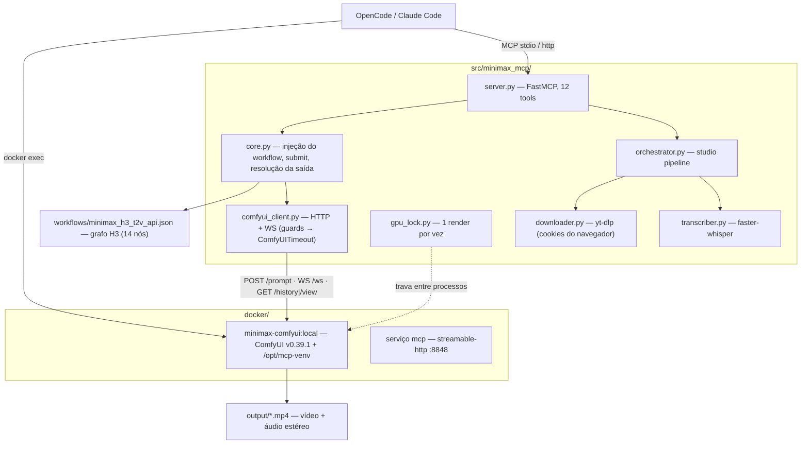
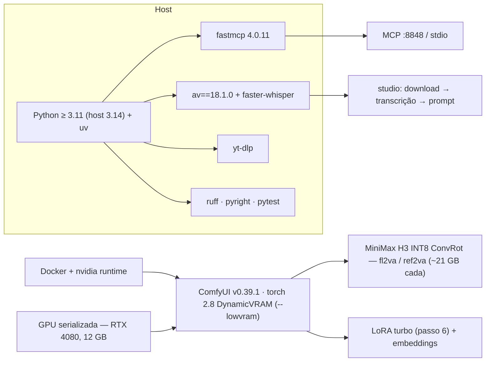
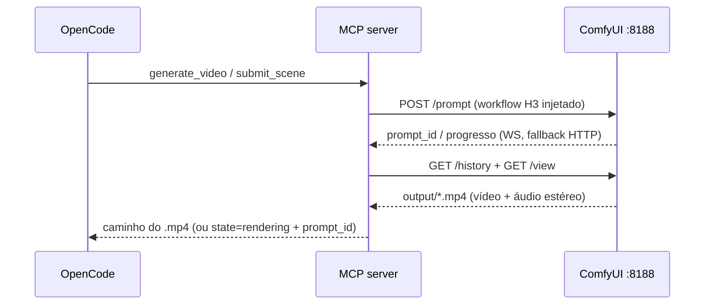

# Arquitetura — minimax-video-factory

Três leituras do mesmo sistema: o que existe (estrutura), com que é feito
(stack) e como um clipe é gerado (fluxo). Detalhes operacionais em
[ARCHITECTURE.md](ARCHITECTURE.md).

## Estrutura

## Stack

## Fluxo

